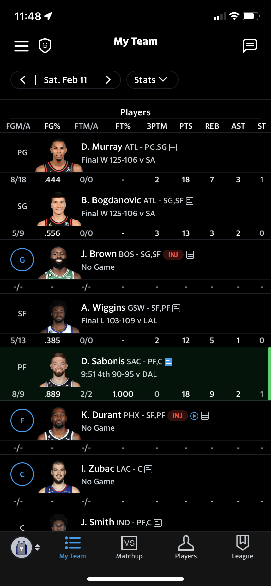
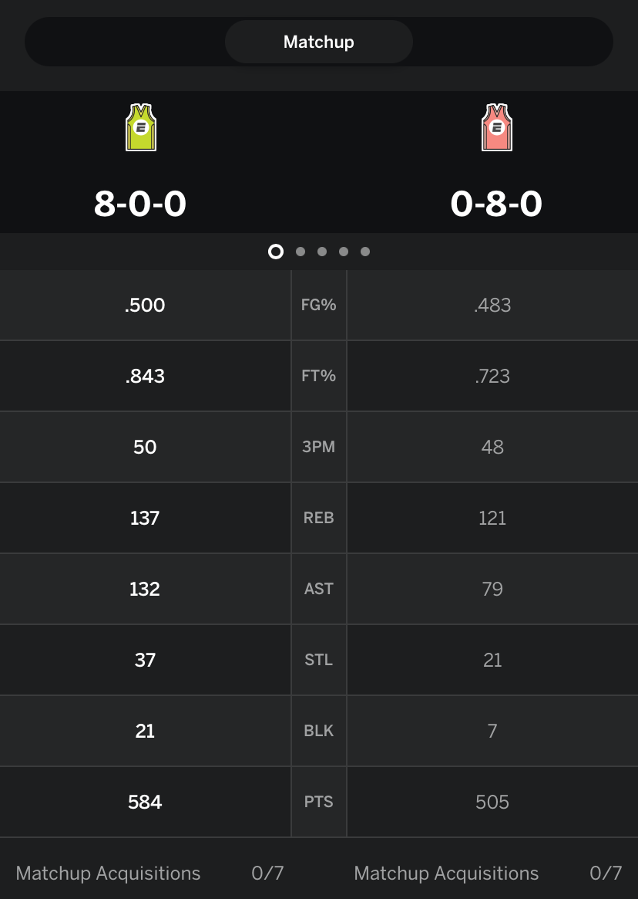

### Danny-AInge
Legendary NBA GM powered by machine learning! Predicts NBA stats and manages your Yahoo Fantasy Basketball team.

# Overview 
Danny AI-nge is trained on data scrapped from the [NBA's offical stats website](https://www.nba.com/stats) using [nba_api](https://github.com/swar/nba_api) and [balldontlie API](https://app.balldontlie.io/). Statistics of interest include player advanced stats, per game stats and team advanced stats by season. The 2021-2022 season will be used as the validation set.

Danny-AInge
## [Yahoo Fantasy Basketball](https://basketball.fantasysports.yahoo.com/)
In Yahoo Fantasy Basketball, 2-20 people compete to manage their own NBA rosters where real life NBA games impact the outcome of the fantasy basketball league. Although you may draft players from different teams, there are limitations to make the game more interesting. 

Each starting roster is limited to one player for each traditional NBA position, 2 flex slots called guard(PG,SG) and forward(SF,PF), an additional slot for another center, and 2 additional UTL slots that can slot in players despite their position. Three additional spots are available for players on the bench. In case of player injury, the injured player may be moved to the IR(Injury reserves) and another player can be added to the roster until the injured player is healthy and gets removed from the IR. Users may only have a maximum of two players in the IR. Stats earned by bench players and IR players will not be counted. 

To optimize your roster, it is essential to make use of each slot to earn the most points in the specific scoring format you're playing.

A Fantasy Basketball league can be adjusted to work off of different scoring formats. Here's the formats used by Yahoo. 

# Rotisserie
Go up against your entire league for the best season-long stats. While you're ranked daily, the only time your standings matter is at the end of the season. Points are used for quick visual aid, but your stats are what count.

Your rank, out of the total number of managers, in a stat category earns you the inverse number of points. Example with a league containing 10 managers:

1st place in a stat category, earns 10 points
10th place in a stat category, earns 1 point

Unlike other scoring formats, where your points are accumulated over time, the total available points are static and don't change in a Rotisserie league. Your standing within that set of points is what changes from day to day based on your accumulated stats.

As your rank per stat category rises or falls, your total points adjust accordingly each day and any difference from your standings in previous day is tracked with positive and negative numbers in the "Pts Change" column.

The maximum number of points a manager can earn is the number of tracked stat categories multiplied by the number of managers in a league. In a 10 manager league tracking 10 stat categories, a manager who earns 1st place in every stat category would have 100 points.

# Head-to-head: Standard
Each week, your goal is to get the best stats from your active players.

Tracked stat categories:
Each stat is considered 1 game per Game Week.
Games being won at any given time are shown on the league page.
Standings are finalized and added to your record at the end of each Game Week.
Stats reset at the start of each new Game Week.
W-L-T record:
Weekly wins, losses, and ties accumulate each week.
Your record is tracked in a Wins-Losses-Ties (W-L-T) format.
Your W-L-T record determines your standings and who wins the championship.

# Head-to-Head: One Win
This is identical to Head-to-Head (standard), except only 1 point is added to the W-L-T record per week.

1 added to Win - The manager with the most games won.
1 added to Loss- The manager with the most games lost.
1 added to Tie - Both managers win the same number of games.

# Head-to-head: Points
Play against a different team each week to earn the most total points, instead of winning stat categories! You’ll also only get 1 point added to your W-L-T record per week.

The commish defines how many points each tracked stat is worth.
See what your commish setup is in the "League" tab, by clicking Settings.
The total points earned in a week determine what's added to the W-L-T record:
1 added to Win - The manager with the most points.
1 added to Loss - The manager with the least points.
1 added to Tie - Both managers have the same points.
Points reset at the start of a new Game Week.

# Points Only
Active players earn points each time a tracked stat is achieved.
Your points accumulate throughout the season in your team's total.
Highest point total at the end of the year wins the league championship.

## Features
Danny AInge will use the Yahoo API to securely access your team and automate changes and roster moves with the press of a button. The initial scope of the project will only optimize for head to head game modes.

Machine learning algorithms will be used to predict the stats of your team's players, the opposing team's players, and the top 20 available player's statistics. 

Suggestions for your roster will be made, including players to drop and add, and which players to start on your roster.

Additional graphs and dashboards will be added for better visualization to help users understand the model's analytics. 

# Predicted Stats
- FG% (Field Goal %) 
- FT% (Free Throw %) 
- 3PTM (Three Pointers Made)
- PTS (Points)
- REB (Rebounds)
- AST (Assists)
- STL (Steals)
- BLK (Blocks)
- TO (Turnovers)

## Stack

# Backend
- Node JS (TypeScript)
- SQLite
- Tensorflow
- GraphQL
- Express JS
- Yahoo Fantasy Sports API

# Frontend
- TypeScript
- Apollo Client
- NextJS
- TailwindCSS
- SASS

## Demo
WIP 

## Problems & Analysis
WIP

# Problems
- Predicting Rookie Statistics
- ESPN hates developers

# Analysis

